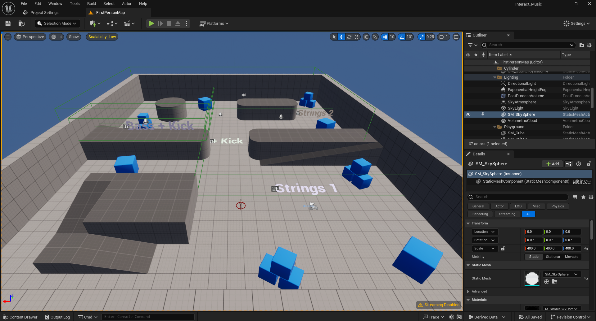
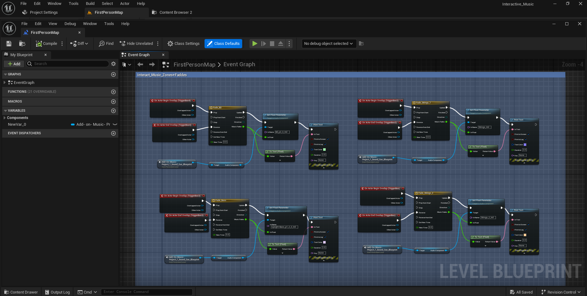

# 🎵 UE Interactive Music System  

### 🛠️ Overview  
This project is a **dynamic interactive music system** for **Unreal Engine 5**, where **musical layers change based on player movement** across different zones. Voices blend naturally when multiple zones intersect, creating an adaptive music experience.  

### 🎮 Features  
✅ **Layered Music System** – Different music voices activate in specific zones  
✅ **Dynamic Audio Blending** – Seamless transitions between audio layers  
✅ **Player-Driven Soundscape** – Music changes based on player movement  
✅ **Blueprint-Based** – Easy to customize within Unreal Engine  

### 📸 Screenshots  
  
  

### 🚀 Installation & Setup  
1️⃣ Clone this repository:  
```bash
git clone https://github.com/unnerror/ue-interactive-music-system.git
```
2️⃣ Run ue5-interactive-music-system/ProjectFiles/Interactive_Music_Project/Interactive_Music.uproject
